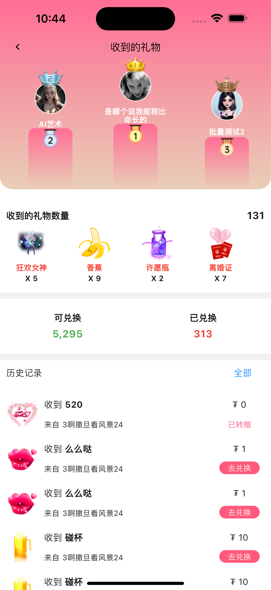
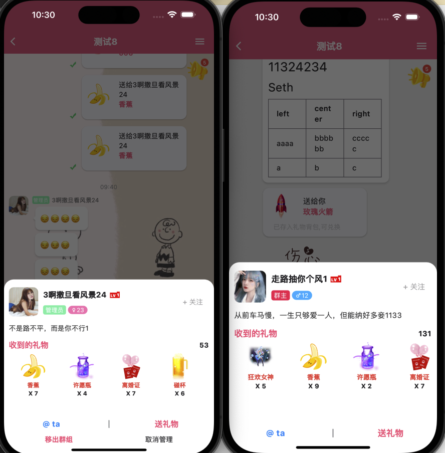
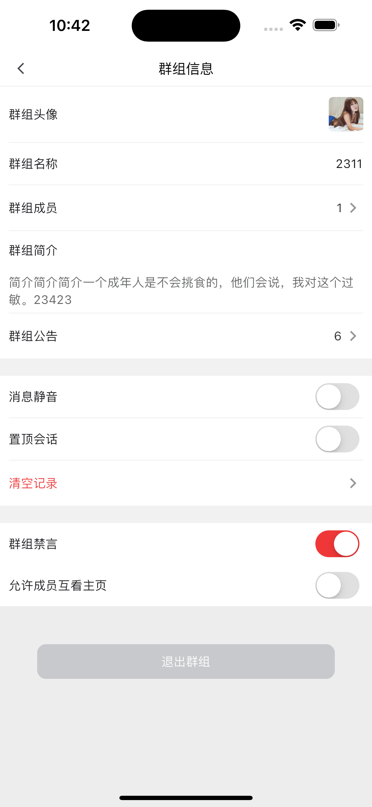

Vtalk IM

# 强大的在线聊天系统功能齐全,单聊,群聊,视频聊天,多人语音房聊天,直播, 不依赖任何第三方,只需要服务器即可搭建十万级用户在线im聊天系统,免除第三方交费封禁烦恼。不限制客户端登录数量，任意账号可多次登录同一客户端

# 可集群水平扩展部署,百万级在线不是梦
# 支持来图定制

````
用户量瓶颈受服务器限制,高并发需要配置集群服务器
````

## 主要技术

mysql,redis,mongo,rabbitmq,rtc,protobuf,rtmp,socket

## 服务端

用户系统  
USDT账户系统  
socket连接系统  
流媒体系统  
rtc系统/(单/多人语音房/视频房/ 多对多/1对多音视频房)  
群组(team)/单聊(p2p)  
后台系统

以上系统均可自由组合,单独定制

## 客户端

| web | app | pc |
|-----|:---:|---:|
| h5  | 原生  | qt |

## 系统语言

| 中文      |   英文    | 其它 |
|---------|:-------:|---:|
| ✔ | ✔ |  * |

``'*' 定制``

# 主要功能

### 消息类型

文字(支持markdown) 图片 视频 语音留言 礼物 usdt红包 @人 文件 系统消息 语音通话 视频通话   
撤回消息 删除消息 引用 

### 会话

删除 静音 置顶 清空历史记录(仅自己/群组所有人)

# app
## 登录/多语言

  
  

## 消息列表/用户分组/我的/设置
  
  
  


## 礼物特效/礼物统计
  
  

## 

## 单聊/群聊展示
  
    

## 单聊/群聊红包
  
  
  

## 群组公告/设置
  
  
  
  


## 消息类型(部分)
  
  
  
  
  

## 语音聊天室/新建/点歌
  
  
  
  
  

## 动态/社区/个人主页
  
  
  

## 短视频/影院
  
  

## 安卓实机
  
  
  
  
  


# h5 演示

# h5演示地址

  
    

| 测试账号 | 111111111 | 111111112 | 111111113 | 111111114 |
|------|:---------:|----------:|:---------:|:---------:|
| 密码   | 123456789 | 123456789 | 123456789 | 123456789 | 

[h5](https://h5.wetalk.im)


# 联系作者
其他客户端 联系
[perry](https://t.me/Perry_DP) 


